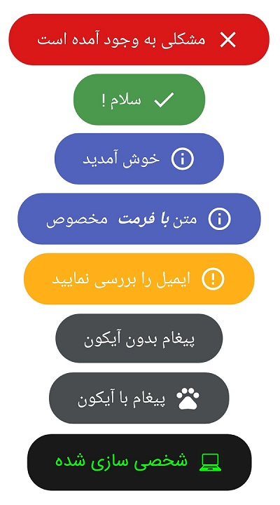


## RTL-Toast

[](https://packagist.org/packages/hatamiarash7/jdf) [](https://packagist.org/packages/hatamiarash7/jdf) [](https://packagist.org/packages/hatamiarash7/jdf)

A library to show Toasts in a pretty RTL way.



### Install
Add it in your root build.gradle
```java
allprojects {
    repositories {
        ...
	maven {
	    url 'https://jitpack.io'
	}
    }
}
```
Add the dependency
```java
dependencies {
    implementation 'com.github.hatamiarash7:RTL-Toast:1.2'
}
```

### Usage
```java
RTLToast.error(context, message, length, withIcon);
RTLToast.success(context, message, length, withIcon);
RTLToast.info(context, message, length, withIcon);
RTLToast.warning(context, message, length, withIcon);
RTLToast.normal(context, message, length, withIcon);
```

You can use formatted strings
```java
RTLToast.info(context, getFormattedMessage())

private CharSequence getFormattedMessage() {  
    final String prefix = "متن ";  
    final String highlight = "با فرمت ";  
    final String suffix = " مخصوص";  
    SpannableStringBuilder ssb = new SpannableStringBuilder(prefix).append(highlight).append(suffix);  
    int prefixLen = prefix.length();  
    ssb.setSpan(new StyleSpan(BOLD_ITALIC), prefixLen, prefixLen + highlight.length(), Spannable.SPAN_EXCLUSIVE_EXCLUSIVE);  
    return ssb;  
}
```

Or you can customize your toast with `RTLToast.Config`
```java
RTLToast.Config.getInstance()  
    .setTextColor(Color.GREEN)  
    .setToastTypeface(Typeface.createFromAsset(getAssets(), "IRANSans.ttf"))  
    .apply();  
RTLToast.custom(context, message, getResources().getDrawable(R.drawable.laptop512), Color.BLACK, length, withIcon, shouldTint).show();
RTLToast.Config.reset();
```



